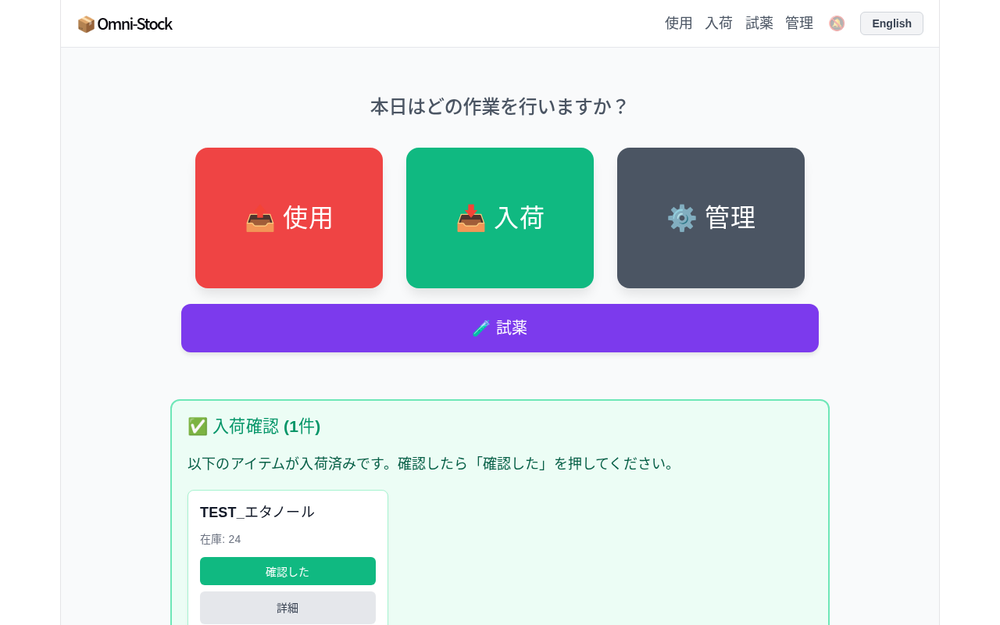
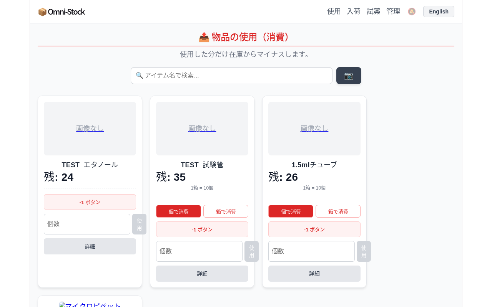
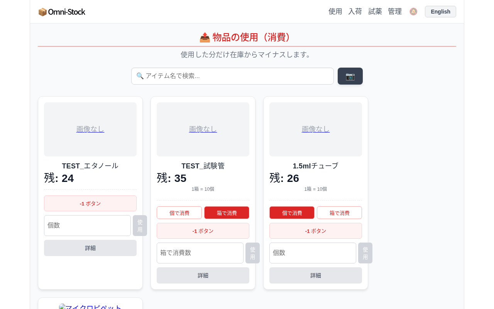
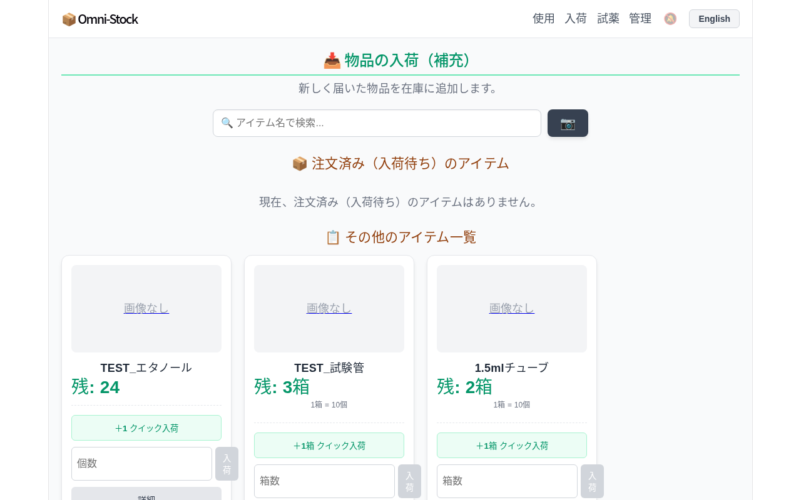
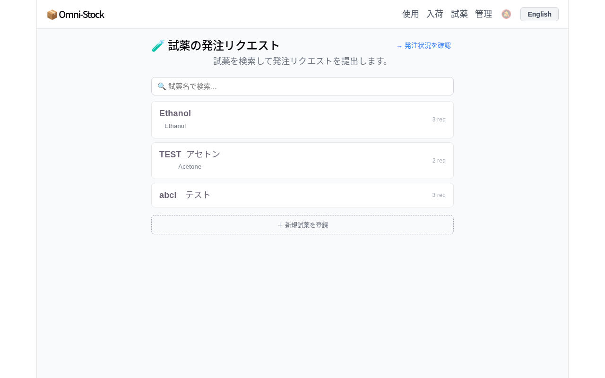
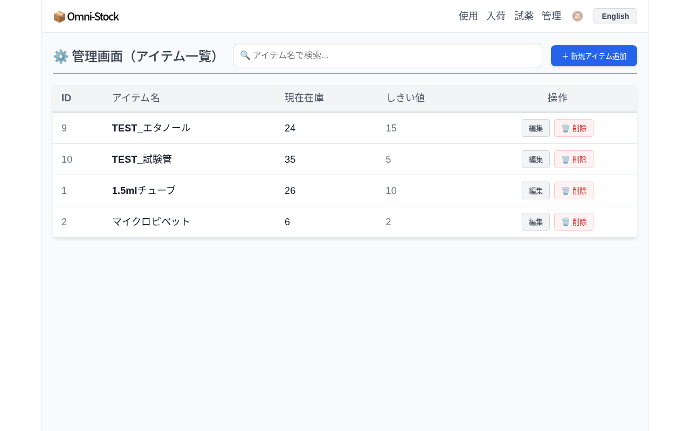
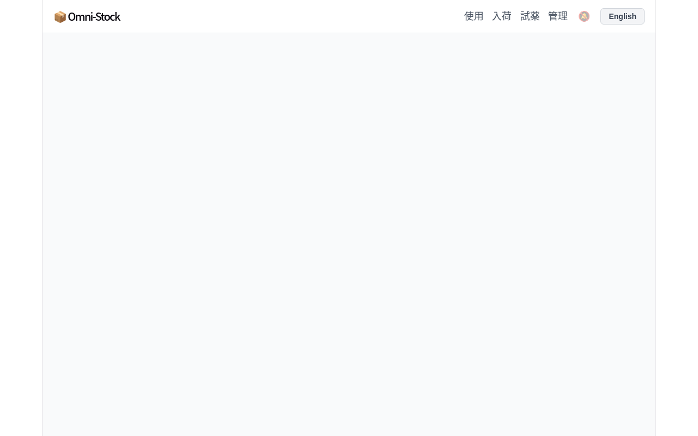
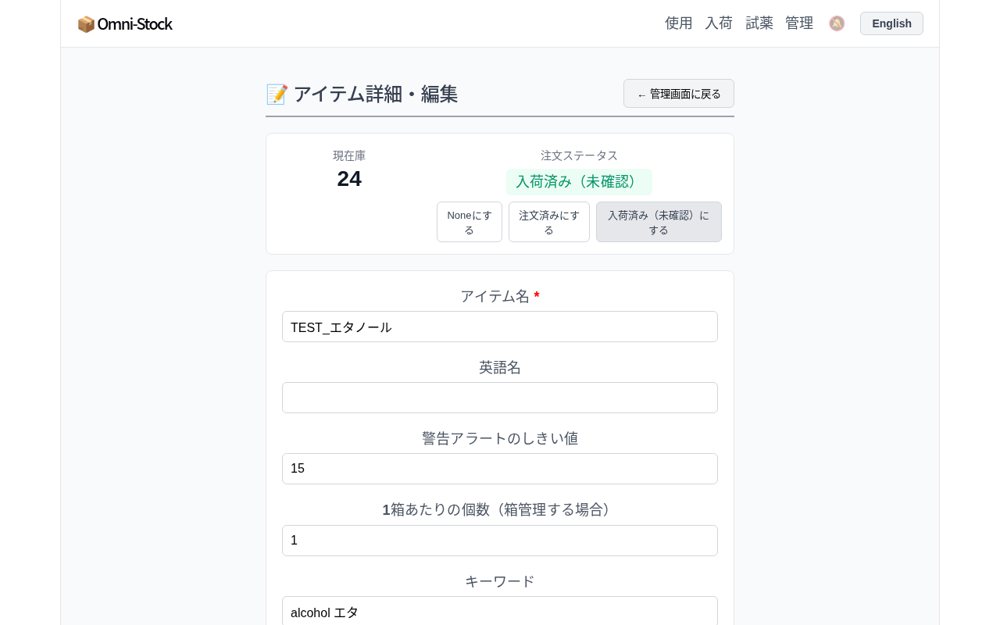

\newpage

# はじめに

**Omni-Stock** は研究室の消耗品・試薬在庫をブラウザで管理するシステムです。

- 在庫の使用・入荷を記録して常に現在の在庫数を把握できます
- 在庫が少なくなるとホーム画面にアラートが表示されます
- 試薬の発注リクエストを提出・管理できます

**アクセス方法**

ブラウザで以下のURLを開いてください（同一ネットワーク内から接続）。

```
http://<サーバーのIPアドレス>:5173
```

\newpage

# 画面の見方

## ナビゲーションバー

画面上部のバーから各機能にアクセスします。



| リンク | 内容 |
|--------|------|
| **使用** | 在庫を消費したときに記録する |
| **入荷** | 物品が届いたときに在庫を追加する |
| **試薬** | 試薬の発注リクエストを提出・管理する |
| **管理** | アイテムの追加・編集・削除を行う |

## ホーム画面

- 起動直後はホーム画面が表示されます
- **在庫低下アラート**：しきい値を下回った物品が一覧で表示されます
- **入荷確認**：入荷済みになった物品の確認ボタンが表示されます
- 各ボタンをクリックすると対応するページに移動できます

\newpage

# 在庫を使う（使用ページ）

試薬や消耗品を実験で使用したとき、使った量をここで記録します。



## 基本操作

1. 使用したアイテムのカードを探す（検索ボックスで絞り込み可能）
2. **－1 ボタン**：1個だけ使った場合はこれを押す
3. **個数を入力** → **使用** ボタン：複数個使った場合は個数を入力して押す

## 箱単位で管理されているアイテム

「1箱 ＝ N個」で管理されているアイテムでは、**個で消費** / **箱で消費** ボタンが表示されます。



| ボタン | 動作 |
|--------|------|
| **個で消費** | 入力した個数分を在庫から引く |
| **箱で消費** | 入力した箱数 × 1箱あたりの個数を在庫から引く |

> **注意**：在庫数を超える量を入力すると「在庫不足」エラーが表示され、操作はキャンセルされます。

\newpage

# 在庫を入荷する（入荷ページ）

物品が届いたときに在庫数を増やします。



## 画面の構成

- **注文済み（入荷待ち）のアイテム**：発注中の物品が先頭にまとめて表示されます
- **その他のアイテム一覧**：発注状態に関係なく追加できます

## 操作手順

1. 届いたアイテムのカードを探す
2. **＋1 クイック入荷**：1個（または1箱）だけ入荷した場合はこれを押す
3. **箱数 / 個数を入力** → **入荷** ボタン：複数の場合は数量を入力して押す

## 箱単位の物品

「1箱 ＝ N個」設定のアイテムは残量が **箱数表示**（例：「残: 3箱」）になります。
入力欄も **箱数** で入力します（システムが自動で個数に換算して加算します）。

| 表示例 | 意味 |
|--------|------|
| 残: 24 | 個別管理（24個） |
| 残: 3箱 | 箱管理（1箱=10個なら30個） |
| 1箱 ＝ 10個 | 変換レート表示 |

## 入荷確認ステータスについて

発注中（注文済み）の物品を入荷処理すると、ステータスが自動で **入荷済み（未確認）** に変わります。
ホーム画面の「入荷確認」ボタンを押して確認を完了させてください。

\newpage

# 試薬を発注・管理する（試薬ページ）

試薬の購入リクエストを提出し、購入担当者と情報を共有します。



## 発注リクエストを出す

1. 試薬名で検索する（英語名でも検索可能）
2. 該当の試薬をクリックしてリクエストフォームを開く
3. 依頼者名・数量・備考を入力して送信する

## 新しい試薬を登録する

リストにない試薬は「**＋ 新規試薬を登録**」から追加します。

- 試薬名（日本語）
- 英語名
- 購入先URL（メーカーサイトなど）

## 発注状況を確認する

画面右上の「**→ 発注状況を確認**」から発注中・到着済みの一覧を見ることができます。
物品が届いたら入荷ページから入荷処理することで、試薬のステータスも「到着済み」に更新されます。

\newpage

# アイテムを管理する（管理ページ）

在庫アイテムの登録・編集・削除を行います。



## アイテムを追加する

「**＋ 新規アイテム追加**」ボタンから追加画面を開きます。



| 項目 | 説明 | 必須 |
|------|------|------|
| アイテム名 | 他と重複しない名前を入力 | ◯ |
| 英語名 | 検索用（省略可） | |
| 初期在庫数 | 登録時の現在在庫 | ◯ |
| 警告しきい値 | この個数を下回るとホームにアラート表示 | ◯ |
| 1箱あたりの個数 | 箱管理する場合に設定（デフォルト：1） | |
| キーワード | 検索用タグ（スペース区切りで複数可） | |
| 購入先URL | 発注時のリンク | |
| 画像 | カードに表示されるサムネイル | |

## アイテムを編集する

管理ページの「**編集**」ボタン、または各ページのカードにある「**詳細**」ボタンから編集画面を開きます。



- 在庫数・注文ステータスの確認ができます
- ステータスを手動で「注文済み」「入荷済み」に変更することもできます
- 操作履歴（いつ、何個使用・入荷したか）が画面下部に表示されます

## アイテムを削除する

管理ページの「**削除**」ボタンを押すと削除確認が表示されます。
**削除したアイテムは元に戻せません。**

\newpage

# よくある質問

**Q. 在庫数がマイナスになりません**
A. 使用量が現在の在庫を超える場合、操作はキャンセルされ「在庫不足」エラーが表示されます。
実際の在庫数を確認し、在庫数が合っていなければ管理者に連絡してください。

**Q. 同じ名前のアイテムを登録しようとするとエラーになります**
A. アイテム名は重複できません。既存のアイテムを「管理」ページから検索して編集してください。

**Q. ホームに「入荷確認」が表示されています**
A. 発注中だったアイテムが入荷処理されたことを意味します。
物品の現物を確認し、「確認した」ボタンを押してください。

**Q. 箱管理の設定方法は？**
A. アイテムの「編集」画面から「**1箱あたりの個数**」を設定します（例：10）。
設定後、入荷ページでは箱数で入力でき、使用ページでは個・箱どちらでも消費できます。

**Q. 英語で使いたい**
A. 画面右上の「**English**」ボタンで言語を切り替えられます。

\newpage

# 困ったときは

システムに問題が発生した場合は、管理者（システム担当者）に連絡してください。

---

*Omni-Stock — 研究室在庫管理システム*
